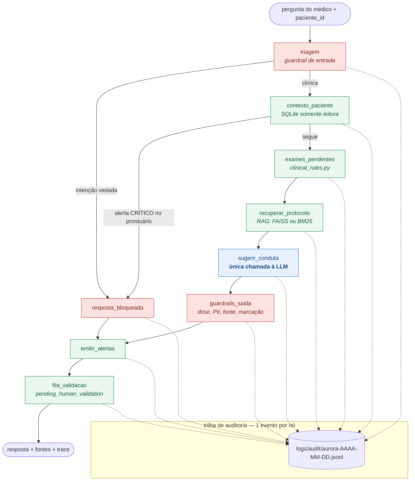

# Arquitetura da Solução — FASE 3

Assistente virtual médico do Hospital Aurora — Tech Challenge FIAP, Jeferson Verdan.

---

## 1. Visão geral

O sistema tem quatro camadas, e a fronteira entre elas é deliberada:

| Camada | Responsabilidade | Determinístico? |
| --- | --- | --- |
| **Dados** | corpus institucional, prontuários anonimizados, dataset de treino | sim |
| **Modelo** | LLM ajustada por LoRA aos documentos internos | não |
| **Orquestração** | LangChain (cadeias, tools, RAG) + LangGraph (fluxo com estado) | parcialmente |
| **Governança** | guardrails, regras clínicas, alertas, auditoria, validação humana | **sim** |

A regra que organiza tudo: **a LLM redige, as regras decidem**. Nenhum gatilho de segurança
depende do que o modelo escolheu gerar.

---

## 2. Fluxo LangGraph



**Leitura do diagrama:** verde = determinístico, azul = LLM, vermelho = camada de bloqueio.
A LLM aparece uma única vez e sempre entre duas camadas vermelhas.

---

## 3. Componentes

### 3.1 Camada de dados (`datagen/`, `data/`)

| Módulo | Papel |
| --- | --- |
| `anonymizer.py` | pseudonimização HMAC-SHA256 + redação regex de PII + generalização de idade |
| `generate_patients.py` | prontuários sintéticos com PII → anonimização → SQLite |
| `build_finetune_dataset.py` | curadoria, aumento, portão de PII, deduplicação e split |

O corpus institucional é escrito em markdown com *frontmatter* (`id`, `versao`, `secao`),
o que dá a cada trecho recuperado uma identidade citável — a base da explicabilidade.

### 3.2 Camada de modelo (`finetune/`)

| Módulo | Papel |
| --- | --- |
| `data_module.py` | chat template + **mascaramento do prompt** (loss só na resposta) |
| `train_lora.py` | SFT com PEFT/LoRA, parametrizado por YAML |
| `metrics.py` | ROUGE-L próprio (PT-BR) + métricas de conformidade de segurança |
| `evaluate.py` | comparação base × ajustado nas duas dimensões |
| `notebook_colab.ipynb` | execução ponta a ponta em T4 |

### 3.3 Camada de orquestração (`assistant/`)

| Módulo | Papel |
| --- | --- |
| `llm_provider.py` | `ChatLoRAHuggingFace` e `ChatFallbackDeterministico`, ambos `BaseChatModel` |
| `retriever.py` | `BackendVetorial` (FAISS) ou `BackendBM25`, com metadados de fonte |
| `db_tools.py` | 7 tools LangChain com SQL parametrizado, conexão `mode=ro` |
| `chains.py` | `PROMPT | LLM | parser` com blocos PACIENTE / FATOS / CONTEXTO / PERGUNTA |
| `graph.py` | `StateGraph` de 9 nós, arestas condicionais e API `responder()` |

### 3.4 Camada de governança

| Módulo | Papel |
| --- | --- |
| `clinical_rules.py` | matriz de alertas, exames pendentes, checklists, encaminhamentos |
| `guardrails.py` | 3 camadas: entrada, aterramento e saída |
| `audit.py` | JSONL append-only, um evento por nó, com filtro de PII |
| `prompts.py` | system prompt institucional — **fonte única** para treino e runtime |

---

## 4. Fluxo de dados

```text
protocolos .md ──┐
FAQs .jsonl    ──┼──► build_finetune_dataset.py ──► train/val/test.jsonl ──► train_lora.py ──► adapter LoRA
modelos .md    ──┤                              └──► documentos_rag.jsonl ──► retriever ─┐
                 │                                                                        │
prontuários     ─┴──► anonymizer ──► hospital.db ──► db_tools ──► clinical_rules ──► graph ┴──► resposta
brutos (PII)                                                                                   + fontes
                                                                                               + alertas
                                                                                               + auditoria
```

Observe que **o mesmo corpus alimenta duas rotas**: o fine-tuning (conhecimento internalizado)
e o RAG (conhecimento citável). O fine-tuning ensina *como responder*; o RAG garante *de onde
veio a informação*. Sozinho, o fine-tuning não daria explicabilidade — um modelo não consegue
apontar com confiabilidade qual trecho gerou qual afirmação.

---

## 5. Decisões de implementação

### 5.1 Por que LoRA e não fine-tuning completo

O corpus institucional tem centenas de amostras. Ajuste completo de um modelo de 1B+
parâmetros nesse volume leva a esquecimento catastrófico: o modelo decora o corpus e perde
fluência geral. LoRA treina ~0,5% dos parâmetros, cabe na T4 gratuita e produz um adapter de
poucas dezenas de MB, versionável no repositório.

### 5.2 Por que mascarar o prompt na loss

Sem mascaramento, boa parte do gradiente é gasta reproduzindo o system prompt e a pergunta —
texto que o modelo nunca precisa gerar. Com `labels = -100` nas posições do prompt, o sinal
de treino se concentra na resposta clínica. Em amostras longas contextualizadas, o prompt
chega a 75% dos tokens, então o efeito é grande.

### 5.3 Por que tools fechadas em vez de agente com SQL livre

Um `SQLDatabaseToolkit` deixaria a LLM escrever SQL arbitrário. Trocamos flexibilidade por
garantias: 7 tools com consultas parametrizadas e revisadas, sobre uma conexão somente
leitura. O assistente é fisicamente incapaz de alterar o prontuário, como o PROT-007 exige.
O custo: uma pergunta que exija um recorte não previsto não é atendida. Em sistema clínico,
é o lado certo do trade-off.

### 5.4 Por que separar FATOS de CONTEXTO no prompt

`FATOS` traz números já calculados pelo motor determinístico (dias em aberto, escores,
pendências); `CONTEXTO` traz o texto do protocolo. Separando, a LLM não precisa — e é
instruída a não — recalcular nada. Isso reduz a superfície da alucinação numérica, o erro
mais perigoso em um assistente clínico.

### 5.5 Por que guardrails determinísticos

Um guardrail que dependa de a LLM "se comportar" não é um guardrail. Todas as três camadas
são regex e regras Python, testadas isoladamente. A camada de entrada bloqueia **antes** de
qualquer chamada à LLM — no caso de pedido de prescrição, o modelo nem é acionado, o que se
verifica no `trace` da resposta (`sugerir_conduta` não aparece).

### 5.6 Por que dose e valor de exame precisam de tratamento diferente

"Glicemia de 126 mg/dL" e "volume ovariano ≥ 10 mL" são leitura legítima do prontuário;
"iniciar 850 mg" é prescrição. O sanitizador usa duas estratégias: unidades que praticamente
só aparecem como dose (`mg`, `mcg`, `UI`) e não seguidas de `/`; e unidades ambíguas (`mL`,
`g`, `gotas`) apenas quando precedidas de verbo de posologia. A mesma função é usada pelo
guardrail de produção e pela métrica de avaliação — fonte única, para que não divirjam.

### 5.7 Por que auditoria por nó, e não por interação

Um log por interação diz *o que* o assistente respondeu. Um log por nó diz *como* ele chegou
lá: qual intenção foi classificada, quais trechos foram recuperados com que score, qual
prompt exato foi enviado à LLM, quais guardrails dispararam. Para auditoria clínica, o
caminho importa tanto quanto o resultado.

### 5.8 Privacidade

Nenhum dado real é usado. Ainda assim, o pipeline implementa os controles que seriam exigidos
com dados reais: pseudonimização determinística com sal em variável de ambiente,
generalização de idade em faixas de 5 anos (k-anonimato básico), redação de PII em texto
livre, portão de qualidade que reprova o build do dataset se sobrar PII, e filtro de campos
proibidos antes de cada gravação na auditoria.

---

## 6. Observabilidade

```text
LOG_LEVEL=DEBUG   # logging estruturado de todos os módulos
AUDIT_LOG_DIR     # trilha de auditoria (default: logs/audit)
```

Três superfícies:

1. **Logs de aplicação** (`logging`) — carregamento de modelo, degradação para fallback,
   backend de RAG escolhido, alertas ALTO/CRÍTICO.
2. **Trilha de auditoria** (`logs/audit/aurora-*.jsonl`) — evento por nó, imutável.
3. **Fila de validação** (`logs/audit/pending_human_validation.jsonl` e `validacoes.jsonl`) —
   estado da governança clínica.

---

## 7. Execução

```bash
# 1. Base sintética e dataset
python datagen/generate_patients.py --n-pacientes 40 --seed 62
python datagen/build_finetune_dataset.py --seed 62

# 2. Fine-tuning (Colab T4) — finetune/notebook_colab.ipynb
python finetune/train_lora.py --config finetune/configs/lora_tinyllama.yaml
python finetune/evaluate.py --adapter finetune/outputs/adapter --comparar-base

# 3. Demonstração
python run_demo.py
streamlit run app/streamlit_app.py

# 4. Testes
pytest -q
```
