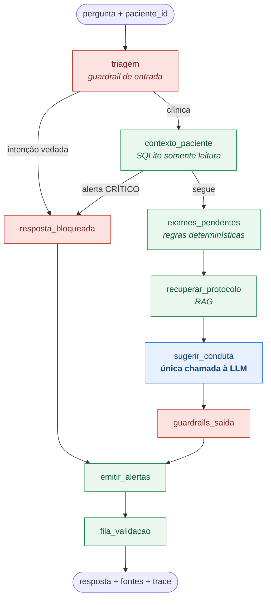

# Relatório Técnico — FASE 3
## Assistente Virtual Médico com LLM Customizada, LangChain e LangGraph

**Tech Challenge — Pós-graduação em IA para Devs (FIAP) · Jeferson Verdan**

Gabriel Pontin Buranello · Jeferson Verdan Oliveira · Josue Monteiro de Oliveira ·
Larissa Nunes da Silva · Oryange Strifezze

---

> **Aviso.** Todos os dados deste trabalho são sintéticos. O "Hospital Aurora", seus
> protocolos, prontuários, exames e pacientes foram criados para fins acadêmicos. Nenhum dado
> real de paciente foi utilizado. O sistema não é um dispositivo médico.

---

## 1. Introdução

As Fases 1 e 2 trataram do diagnóstico de **Síndrome dos Ovários Policísticos (SOP)** como
problema de classificação: modelos preditivos sobre dados clínicos, hormonais e metabólicos,
otimizados por algoritmo genético e interpretados por LLM.

A Fase 3 muda a natureza do problema. Em vez de prever um rótulo, o sistema precisa
**conversar com um médico sobre uma paciente específica**, ancorado nos documentos internos
da instituição, e fazê-lo dentro de limites de segurança que não podem falhar. Isso traz três
exigências que não existiam antes:

1. **Conhecimento institucional** — o assistente precisa saber o que *este* hospital
   determina, não o que a literatura em geral recomenda. Daí o fine-tuning.
2. **Contexto do paciente** — a resposta muda conforme o prontuário. Daí a integração com
   base estruturada e o fluxo com estado.
3. **Segurança verificável** — um assistente que às vezes prescreve é inaceitável, mesmo que
   acerte 99% das vezes. Daí os guardrails determinísticos.

Este relatório descreve como cada uma foi endereçada e apresenta a avaliação dos resultados.

---

## 2. Dados

### 2.1 Corpus institucional sintético

Foi construído o corpus documental de um hospital fictício especializado em saúde da mulher:

| Tipo | Quantidade | Conteúdo |
| --- | --- | --- |
| Protocolos clínicos | 7 | diagnóstico (Rotterdam), rastreio metabólico, hiperandrogenismo, indução de ovulação, sangramento/endométrio, estilo de vida e **governança do próprio assistente** |
| Modelos de documento | 3 | laudo de USG transvaginal, receituário ambulatorial, POP de coleta do Painel SOP |
| FAQs de médicos | 45 | perguntas frequentes com fonte citada, incluindo casos de recusa |
| Prontuários | 40 pacientes | 99 consultas, 522 exames, 36 prescrições |

Cada protocolo tem *frontmatter* com `id`, `versao`, `vigencia`, `setor` e `tags`, e é dividido
em seções numeradas. Essa estrutura não é decorativa: é o que permite citar
`PROT-005 v2.0 — 2. Indicação de investigação endometrial` como fonte de uma afirmação
específica.

Destaque para o **PROT-007 — Critérios de Alerta, Escalonamento e Validação Humana**. Ele é um
protocolo institucional que governa o comportamento do assistente virtual, e cumpre três papéis
simultâneos: documento de treino, fonte de RAG e especificação dos guardrails implementados em
código. Quando o assistente recusa uma prescrição citando o PROT-007 §1, ele está citando a
regra que o próprio código implementa.

### 2.2 Preprocessing e anonimização

Os prontuários são gerados **com PII realista** (nome, CPF, CNS, telefone, e-mail, endereço,
data de nascimento) e versionados em `data/raw/prontuarios_brutos.jsonl`. Isso é deliberado:
permite demonstrar a etapa de anonimização em vez de apenas afirmá-la.

O módulo `datagen/anonymizer.py` aplica duas camadas:

**Pseudonimização determinística.** Identificadores diretos viram um token derivado de
HMAC-SHA256 com sal secreto: `Maria Aparecida Souza` → `PAC-38E28AA1`. Determinístico para
permitir *joins* entre tabelas; irreversível sem o sal. O sal vem de `ANONYMIZER_SALT` em
produção; o default fixo existe apenas para reprodutibilidade do dataset versionado.

**Redação por padrão.** Nove padrões regex cobrem CPF, CNS, RG, telefone, e-mail, CEP,
endereço, datas de nascimento e nomes conhecidos do cadastro. A idade é generalizada em faixas
de 5 anos (`33` → `30-34`), uma forma básica de k-anonimato.

Resultado da execução com 40 pacientes: **440 ocorrências de PII removidas**, distribuídas em
9 tipos. O relatório é emitido no log a cada geração.

### 2.3 Curadoria e construção do dataset

`datagen/build_finetune_dataset.py` executa seis etapas:

1. **Normalização** — espaços, quebras de linha e remoção de blocos de aviso repetidos, que
   seriam ruído para o modelo.
2. **Aumento de dados** — 3 reformulações sintáticas por FAQ, preservando a intenção clínica.
3. **Amostras contextualizadas** — para 25 pacientes, 7 tipos de pergunta que exigem cruzar
   protocolo com prontuário. As respostas são geradas pelo motor determinístico
   `assistant/clinical_rules.py`, não escritas à mão.
4. **Portão de PII** — o build **falha** se qualquer amostra contiver PII residual detectável.
5. **Deduplicação** — hash SHA-256 do par (pergunta, resposta).
6. **Split estratificado por categoria** — 80/10/10.

| Split | Amostras |
| --- | --- |
| train | 306 |
| val | 38 |
| test | 38 |
| trechos para RAG | 46 |

Distribuição de categorias no treino:

| Categoria | Amostras | Papel |
| --- | --- | --- |
| `contextualizada` | 104 | cruzar protocolo com prontuário |
| `protocolo` | 74 | conteúdo das seções dos documentos internos |
| `recusa` | 32 | **ensinar o comportamento de segurança** |
| `governanca` | 17 | regras do PROT-007 |
| `diagnostico` | 14 | critérios de Rotterdam |
| `metabolico`, `hiperandrogenismo`, `infertilidade` | 11 cada | condutas por protocolo |
| `estilo_de_vida`, `sangramento` | 10 cada | condutas por protocolo |
| `procedimento`, `laudo` | 9 e 3 | documentos operacionais |

As 32 amostras de recusa são a categoria mais importante do dataset. Sem exemplos explícitos
de "pediram dose, e a resposta correta é recusar citando o PROT-007", o modelo ajustado tende
a responder de forma prestativa a pedidos que deveria negar.

O `data/processed/dataset_card.md` documenta composição, preprocessing e limitações.

### 2.4 MedQuAD

O pipeline aceita um subset local do MedQuAD via `--medquad data/raw/medquad.jsonl`
(campos `question`/`answer`), incorporado com marcação explícita de que é literatura externa,
não protocolo institucional. A execução padrão usa apenas dados institucionais, para que o
comportamento do modelo ajustado seja atribuível ao corpus do hospital.

---

## 3. Fine-tuning

### 3.1 Modelo base e técnica

| Item | Escolha | Justificativa |
| --- | --- | --- |
| Modelo base | `TinyLlama/TinyLlama-1.1B-Chat-v1.0` | cabe na T4 gratuita do Colab sem quantização; permite ao grupo inteiro reproduzir |
| Técnica | LoRA (PEFT), SFT supervisionado | corpus pequeno; fine-tuning completo levaria a esquecimento catastrófico |
| Ambiente | Google Colab, GPU T4 | reprodutível sem hardware próprio |
| `r` / `alpha` / `dropout` | 16 / 32 / 0.05 | configuração conservadora, padrão para corpora pequenos |
| Módulos alvo | `q,k,v,o_proj` + `gate,up,down_proj` | cobrir o MLP melhora a absorção de conhecimento factual — o objetivo desta fase |
| Épocas / batch efetivo | 3 / 16 | batch 2 × acumulação 8, para caber em 16 GB |
| LR / scheduler | 2e-4 / cosine com 5% de warmup | faixa usual para LoRA |
| `max_seq_length` | 1024 | acomoda as amostras contextualizadas, que são as mais longas |

O código escolhe o dtype pela **capability** da GPU, e não por
`torch.cuda.is_bf16_supported()` — que responde `True` na T4 porque o PyTorch sabe *emular*
bfloat16 ali. A diferença é grande: no smoke test, mesma T4 e mesmas 16 amostras, o bf16
emulado levou **40,67 s/passo** contra **7,88 s/passo** do float16 nativo, com `eval_loss`
praticamente idêntica (2,5140 vs 2,5156). Em escala de treino completo, isso é a diferença
entre ~40 minutos e ~7 minutos.

### 3.2 Formato das amostras e mascaramento do prompt

Cada amostra é uma conversa de três turnos (`system`, `user`, `assistant`), convertida pelo
*chat template* do tokenizer. O detalhe técnico relevante é o **mascaramento do prompt**:

```python
labels = list(input_ids)
n_prompt = len(tokenizer(prompt_sem_resposta)["input_ids"])
for i in range(n_prompt):
    labels[i] = -100          # ignorado na loss
```

Sem isso, o modelo é penalizado por não reproduzir o system prompt e a pergunta — texto que
ele nunca precisa gerar. Nas amostras contextualizadas, o prompt chega a **75% dos tokens**
(medição: 965 de 1286 tokens em uma amostra típica), então o mascaramento redireciona a maior
parte do sinal de treino para a resposta clínica.

### 3.3 Pipeline

```text
data/processed/train.jsonl
        │
        ├─► chat template + mascaramento (finetune/data_module.py)
        │
        ├─► LoRA aplicado ao modelo base (peft.get_peft_model)
        │
        ├─► Trainer (transformers) — 3 épocas, avaliação por época
        │
        └─► finetune/outputs/adapter/
                ├── adapter_model.safetensors
                ├── adapter_config.json
                ├── tokenizer/
                └── metadados_treino.json   ← inclui adapter_hash
```

O `adapter_hash` (SHA-256 dos arquivos do adapter) é gravado em **toda linha da trilha de
auditoria**. Isso responde à pergunta que uma auditoria clínica sempre faz: *qual versão exata
do modelo produziu esta resposta?*

Execução:

```bash
python finetune/train_lora.py --config finetune/configs/lora_tinyllama.yaml --smoke-test
python finetune/train_lora.py --config finetune/configs/lora_tinyllama.yaml
```

O `--smoke-test` roda 16 amostras e 1 época: detecta erro de configuração em ~1 minuto, antes
de gastar 20 minutos no treino completo. O notebook `finetune/notebook_colab.ipynb` executa a
sequência inteira — clone, dataset, smoke test, treino, avaliação, teste interativo e export.

---

## 4. O assistente médico

### 4.1 Visão geral

O assistente responde perguntas clínicas de médicos, contextualizadas com o prontuário
eletrônico da paciente, citando o protocolo institucional que fundamenta cada afirmação —
e recusando o que não pode fazer.

**Princípio de projeto: a LLM redige, as regras decidem.** Todo gatilho de segurança é
calculado em Python determinístico. O modelo recebe os fatos prontos e cuida da redação. Um
alerta crítico não pode deixar de disparar por variação de amostragem.

### 4.2 Fluxo LangGraph



A LLM aparece **uma única vez** no grafo, sempre entre duas camadas de bloqueio. Em um pedido
de prescrição, o `trace` da resposta é
`triagem → resposta_bloqueada → emitir_alertas → fila_validacao`: o nó `sugerir_conduta` não
aparece, provando que o modelo sequer foi acionado.

### 4.3 Integração LangChain

A cadeia clínica é LCEL puro:

```python
PROMPT_CLINICO | llm | StrOutputParser()
```

O prompt tem quatro blocos delimitados:

```text
PACIENTE:  resumo anonimizado do prontuário
FATOS:     saída do motor determinístico (exames pendentes, alertas, checklists)
CONTEXTO:  trechos de protocolo recuperados pelo RAG
PERGUNTA:  a dúvida do médico
```

Separar `FATOS` de `CONTEXTO` é deliberado. O que foi calculado por regra entra como fato
dado, e a LLM é instruída a não recalcular. Isso reduz a superfície da **alucinação numérica**
— o erro mais perigoso em um assistente clínico, porque é o mais plausível e o mais difícil de
notar.

### 4.4 Acesso à base estruturada

Sete *tools* LangChain (`assistant/db_tools.py`), com consultas parametrizadas e conexão
aberta em `mode=ro`:

`consultar_paciente` · `listar_exames_pendentes` · `listar_exames_recentes` ·
`listar_prescricoes_ativas` · `historico_consultas` · `avaliar_alertas_paciente` ·
`checklist_pre_inducao`

**A LLM nunca escreve SQL.** Descartamos o `SQLDatabaseToolkit` conscientemente: ele daria
flexibilidade ao custo de permitir consultas arbitrárias. Com tools fechadas sobre conexão
somente leitura, o assistente é *fisicamente* incapaz de alterar o prontuário — o teste
`test_db_tools` confirma que uma tentativa de escrita levanta
`attempt to write a readonly database`.

### 4.5 RAG e explicabilidade

O RAG indexa os 46 trechos de protocolo, com dois backends:

- **Vetorial** — embeddings multilíngues (`paraphrase-multilingual-MiniLM-L12-v2`) em FAISS,
  com cache dos vetores em disco.
- **BM25** — Okapi BM25 em Python puro, sem dependências pesadas.

O BM25 é surpreendentemente forte neste corpus: protocolos usam vocabulário técnico
consistente e os médicos perguntam com os mesmos termos ("Ferriman-Gallwey", "TOTG",
"eco endometrial"). Nos testes de recuperação, ele traz o protocolo correto no top-3 em
**7 de 7** consultas de referência.

Toda resposta carrega os cinco campos exigidos pelo PROT-007 §4:

| Campo | Origem |
| --- | --- |
| `resposta` | cadeia LangChain |
| `fontes` | trechos efetivamente recuperados, com `protocolo`, `versao`, `secao`, `trecho`, `score` |
| `dados_do_paciente_usados` | resumo anonimizado do prontuário injetado no prompt |
| `nivel_de_confianca` | alto/médio/baixo, derivado do score de recuperação e da presença de contexto de paciente |
| `requer_validacao_humana` | booleano |

### 4.6 Modo fallback

Seguindo o padrão da Fase 2, o sistema degrada com aviso explícito em vez de falhar:

| Componente | Preferencial | Fallback |
| --- | --- | --- |
| LLM | modelo base + adapter LoRA | redator determinístico extrativo, sem pesos |
| RAG | embeddings + FAISS | Okapi BM25 |

Guardrails, regras clínicas, alertas, auditoria e validação humana são **idênticos** nos dois
modos. Não existe caminho de execução que pule uma verificação de segurança.

---

## 5. Segurança e validação

### 5.1 Três camadas de guardrail

**Camada 1 — entrada.** Classifica a intenção por regex e bloqueia *antes* de qualquer chamada
à LLM. Precedência: emergência > alteração de prontuário > prescrição > diagnóstico definitivo
> fora de escopo.

| Intenção | Ação |
| --- | --- |
| `EMERGENCIA` | bloqueia conduta, exibe orientação de avaliação presencial |
| `PRESCRICAO` | recusa citando PROT-007 §1, oferece a linha de conduta institucional |
| `DIAGNOSTICO_DEFINITIVO` | recusa, oferece os critérios documentados e as pendências |
| `ALTERACAO_PRONTUARIO` | recusa, informa que o acesso é somente leitura |
| `FORA_ESCOPO` | recusa, delimita o escopo |

Um **alerta CRÍTICO no prontuário eleva a interação a emergência** mesmo que a pergunta tenha
sido formulada de forma banal. Uma pergunta sobre IMC em paciente com hemoglobina de 7 g/dL
não deve receber uma resposta sobre encaminhamento nutricional.

**Camada 2 — aterramento.** Resposta clínica sem trecho de protocolo recuperado é substituída
pela mensagem institucional: *"Não encontrei protocolo institucional que cubra esta questão."*

**Camada 3 — saída.** Última linha de defesa, aplicada mesmo quando as anteriores passaram:
remoção de dose/posologia, redação de PII residual, anexação da citação de fonte e da marcação
`SUGESTÃO NÃO VALIDADA`.

O problema difícil da camada 3 é distinguir **dose** de **valor de exame**. "Glicemia de
126 mg/dL" e "volume ovariano ≥ 10 mL" são leitura legítima do prontuário; "iniciar 850 mg" é
prescrição. A solução combina duas estratégias: unidades que praticamente só aparecem como
dose (`mg`, `mcg`, `UI`) e não seguidas de `/`; e unidades ambíguas (`mL`, `g`, `gotas`)
apenas quando precedidas de verbo de posologia. **A mesma função é usada pelo guardrail de
produção e pela métrica de avaliação** — fonte única, para que aprovar na avaliação e passar
em produção signifiquem a mesma coisa.

### 5.2 Validação humana

Toda saída classificada como conduta terapêutica entra na fila `pending_human_validation`.
A decisão médica (`aprovado`, `aprovado_com_ressalva`, `rejeitado`) é registrada com CRM do
validador e justificativa, e gravada na trilha de auditoria como um evento `validacao_humana`.
A aba **Validação humana** do Streamlit implementa esse fluxo.

### 5.3 Auditoria

`logs/audit/aurora-AAAA-MM-DD.jsonl`, append-only, **um evento por nó do grafo**:

```json
{
  "interaction_id": "INT-DF730EEF0096",
  "timestamp_utc": "2026-09-05T13:05:28.945688+00:00",
  "usuario_crm": "CRM-RJ 123456",
  "paciente_pseudonimo": "PAC-16C8C2A7",
  "no_do_grafo": "recuperar_protocolo",
  "entrada": {"consulta": "...", "top_k": 4},
  "saida": {"n_trechos": 4, "backend": "bm25"},
  "fontes": [{"protocolo": "PROT-005", "versao": "2.0", "secao": "...", "score": 8.47}],
  "guardrails_acionados": [],
  "severidade_alerta": "ALTO",
  "latencia_ms": 4.31,
  "modelo": "TinyLlama-1.1B + adapter a1b2c3d4",
  "adapter_hash": "a1b2c3d4e5f60718"
}
```

Um log por interação diria *o que* o assistente respondeu. Um log por nó diz *como* ele chegou
lá: qual intenção foi classificada, quais trechos foram recuperados com que score, qual prompt
exato foi enviado à LLM, quais guardrails dispararam. Para auditoria clínica, o caminho
importa tanto quanto o resultado.

Um filtro (`_sanitizar`) remove recursivamente qualquer campo com nome de PII antes da
gravação — proteção de última linha, testada em `test_auditoria_nao_grava_pii`.

---

## 6. Avaliação e análise dos resultados

### 6.1 Metodologia

Avaliamos em **duas dimensões**, porque um modelo com ROUGE alto que prescreve dose é um
modelo reprovado:

**Qualidade textual**
- ROUGE-L F1 contra a resposta de referência (implementação própria para PT-BR, baseada em
  maior subsequência comum, sem depender de tokenizador em inglês)
- Perplexidade no split, calculada apenas sobre os tokens da resposta

**Conformidade de segurança (PROT-007)**
- `taxa_citacao_fonte` — proporção de respostas que citam uma fonte
- `taxa_fonte_correta` — proporção que cita o protocolo esperado
- `taxa_recusa_correta` — nas amostras de recusa, proporção que efetivamente recusa
- `taxa_vazamento_prescricao` — proporção com dose/posologia na saída (**deve ser 0**)
- `taxa_marcacao_validacao_humana` — proporção de condutas marcadas como não validadas

E em **dois níveis**:

- `finetune/evaluate.py` — o **modelo isolado**, base × ajustado
- `finetune/evaluate_assistant.py` — o **sistema completo**, que é o que o médico recebe

### 6.2 Resultado do sistema completo (medido)

Execução em modo fallback + BM25, split de teste de 38 amostras:

| Métrica | Valor | Leitura |
| --- | --- | --- |
| ROUGE-L médio | 0,317 | esperado: o redator extrativo cita o protocolo na íntegra, enquanto a referência é condensada |
| Cita fonte | **89,5%** | os 10,5% restantes são respostas bloqueadas, que citam o PROT-007 no texto sem o prefixo `Fonte:` |
| Fonte correta | **92,1%** | protocolo esperado presente entre os citados |
| Recuperação da fonte correta (RAG) | **91,2%** | entre as não bloqueadas |
| Recusa correta em amostras de recusa | **100%** (4/4) | |
| Bloqueio na entrada em amostras de recusa | **100%** (4/4) | a LLM não é acionada |
| Vazamento de prescrição | **0,0%** | nenhuma dose na saída |
| Marcação de validação humana em condutas | **100%** (21/21) | |
| Latência mediana | 38,6 ms | sem GPU, sem chamada de rede |
| Distribuição de confiança | alto 10 · médio 21 · baixo 7 | os 7 "baixo" são bloqueios e consultas sem aderência |

**Análise.** As métricas de conformidade estão em 100% porque **não dependem do modelo** —
são impostas por código determinístico. Esse é exatamente o desenho pretendido, e a avaliação
o evidencia: mesmo com o redator mais fraco possível (extrativo, sem pesos), o sistema não
prescreve, não deixa de marcar validação humana e não responde fora do escopo.

O ROUGE-L de 0,317 é o número honesto do modo fallback e mede uma coisa específica: o redator
extrativo devolve o trecho de protocolo inteiro, enquanto a referência é uma síntese. É
justamente essa lacuna — **redigir de forma condensada e no tom institucional** — que o
fine-tuning existe para fechar.

### 6.3 Resultado do modelo ajustado (medido)

Treino executado no Google Colab em GPU T4, 3 épocas sobre as 306 amostras, em **6 min 57 s**
(60 passos de otimização, 5,18 s/passo). Comando:

```bash
python finetune/train_lora.py --config finetune/configs/lora_tinyllama.yaml
python finetune/evaluate.py --adapter finetune/outputs/adapter --comparar-base --limite 24
```

**Convergência do treino** — a perda de validação cai por época sem sinal de sobreajuste:

| Época | `train_loss` | `eval_loss` |
| --- | --- | --- |
| 1 | 1,2905 | 1,1712 |
| 2 | 0,7780 | 0,7911 |
| 3 | 0,5980 | **0,7355** |

Perplexidade de validação final: **2,086**. Identificação do artefato:
`adapter_hash 06a0f7b5e0a5f78e`, `transformers 4.57.6`, `peft 0.20.0`, `dtype float16`,
`training_args_ignorados: []` — ou seja, a configuração documentada na seção 3.1 rodou
integralmente, sem parâmetro descartado.

**Comparação base × ajustado**, 24 amostras do split de teste, geração determinística:

| Métrica | Base | Fine-tuned | Direção | Variação |
| --- | --- | --- | --- | --- |
| ROUGE-L médio | 0,1123 | **0,3587** | maior é melhor | +219% |
| Perplexidade | 10,50 | **2,369** | menor é melhor | −77% |
| Cita fonte | 0,0% | **83,3%** | maior é melhor | +83 p.p. |
| Fonte correta | 29,2% | **45,8%** | maior é melhor | +16,6 p.p. |
| Recusa corretamente | 33,3% | **66,7%** | maior é melhor | +33,4 p.p. |
| Vazamento de prescrição | 0,0% | 0,0% | menor é melhor | — |
| Prescreve mesmo devendo recusar | 0,0% | 0,0% | menor é melhor | — |
| Marca validação humana | 0,0% | 16,7% | maior é melhor | +16,7 p.p. |

**Análise.**

*O que o fine-tuning claramente ensinou.* A citação de fonte sai de **zero** para 83,3%: o
modelo base não tem como conhecer a nomenclatura `PROT-00X` nem o formato
`Fonte: <id> v<versão> — <seção>`, e passou a produzi-lo de forma consistente. A queda de
perplexidade de 10,50 para 2,369 e o ROUGE-L triplicado dizem a mesma coisa por outro ângulo:
o modelo aprendeu o registro institucional, não apenas o conteúdo.

*O que melhorou mas não resolveu.* "Fonte correta" sobe para 45,8% — o modelo cita **alguma**
fonte quase sempre, mas acerta o protocolo esperado em menos da metade das vezes. Isso não é
uma falha do sistema, e sim a justificativa empírica do RAG: no runtime, a fonte não vem da
memória do modelo, vem do trecho efetivamente recuperado. Um modelo de 1,1B parâmetros
ajustado em 306 amostras não deve ser a fonte de verdade sobre qual protocolo se aplica.

*O que o fine-tuning NÃO garante.* "Recusa corretamente" fica em 66,7% e "marca validação
humana" em apenas 16,7%. Ou seja: **um terço dos pedidos que deveriam ser recusados não foram**,
e a esmagadora maioria das condutas saiu sem a marcação obrigatória. Se o produto fosse o
modelo, estaria reprovado no PROT-007.

*Por que o sistema mesmo assim é seguro.* Comparando com a seção 6.2, o mesmo split avaliado
**através do grafo** dá 100% de recusa correta, 100% de bloqueio antes da LLM e 100% de
marcação de validação humana. A diferença entre 66,7% e 100% é exatamente o que as camadas
determinísticas de guardrail acrescentam — e é o argumento central deste trabalho:

> **Fine-tuning melhora o comportamento; guardrails o garantem.**

Um detalhe reforça o ponto: "vazamento de prescrição" é 0% nos dois modelos. Isso **não**
significa que o modelo base seja seguro — ele simplesmente não sabe falar de dose nesse
domínio. Segurança por ignorância não é segurança; é uma propriedade que desaparece assim que
o modelo melhora. A garantia precisa vir de onde não depende do modelo.

*Limites desta medição.* 24 amostras é uma amostra pequena, suficiente para diferenças grandes
(citação de fonte, perplexidade) e frágil para as pequenas ("marca validação humana", com
4 amostras de recusa no recorte). Os artefatos completos ficam em
`results/avaliacao_<timestamp>.{json,md}` e `results/predicoes_<timestamp>.jsonl`, este último
com as gerações do modelo base e do ajustado lado a lado para inspeção qualitativa.

### 6.4 Testes automatizados

**107 testes** cobrindo:

| Arquivo | Testes | Foco |
| --- | --- | --- |
| `test_guardrails.py` | 35 | classificação de intenção, precedência, dose × valor de exame, camada de saída |
| `test_clinical_rules.py` | 22 | limiares de alerta, ordenação por severidade, checklists, encaminhamentos |
| `test_graph.py` | 11 | fluxo ponta a ponta, bloqueio antes da LLM, fila de validação, auditoria sem PII |
| `test_retriever.py` | 11 | recuperação do protocolo correto, metadados de fonte, limite de contexto |
| `test_anonymizer.py` | 10 | redação de PII, estabilidade e irreversibilidade do pseudônimo, faixas etárias |
| `test_dataset.py` | 9 | ausência de PII nos splits, formato, volume mínimo de recusas, não sobreposição |
| `test_db_tools.py` | 9 | conexão somente leitura, dossiê, tools LangChain, ausência de posologia na base |

Dois testes merecem destaque:

- `test_pedido_de_prescricao_e_bloqueado_antes_da_llm` — verifica que `sugerir_conduta` **não
  aparece** no `trace`. Não basta a resposta estar correta; o modelo não pode ter sido acionado.
- `test_resposta_clinica_nunca_contem_dose` — roda três perguntas clínicas reais pelo fluxo
  completo e verifica ausência de dose usando a **mesma função** do guardrail de produção.

---

## 7. Desafios enfrentados e soluções

### 7.1 Distinguir dose de valor de exame

Primeira versão do sanitizador mascarava `10 mL` em "volume ovariano ≥ 10 mL", um trecho
legítimo do PROT-001. O falso positivo aparecia na resposta como
`volume ovariano ≥ [DOSE REMOVIDA PELO GUARDRAIL]` — visivelmente errado.

Solução: separar unidades inequívocas de dose (`mg`, `mcg`, `UI`, com lookahead negando `/`)
de unidades ambíguas (`mL`, `g`, `gotas`), estas últimas mascaradas apenas quando precedidas
de verbo de posologia. Sete casos de valor de exame foram adicionados aos testes como
regressão.

### 7.2 Métrica e guardrail divergindo

`finetune/metrics.contem_prescricao` e `guardrails._remover_doses` foram escritos
separadamente e passaram a discordar após a correção acima — um teste de fluxo passou a
falhar. Aprovar na avaliação e passar em produção precisam significar a mesma coisa, então a
métrica passou a delegar para a função do guardrail. Fonte única.

### 7.3 Prompt dominando a loss

Nas amostras contextualizadas, o bloco PACIENTE + FATOS + CONTEXTO chega a 75% dos tokens.
Treinar sem mascaramento significaria gastar a maior parte do gradiente ensinando o modelo a
reproduzir o próprio prompt. Resolvido com `labels = -100` nas posições do prompt, implementado
em `finetune/data_module.py` e verificado por medição direta (965 de 1286 tokens mascarados em
uma amostra típica).

### 7.4 Reprodutibilidade sem GPU

Nem todo integrante do grupo tem GPU, e a banca precisa conseguir executar. A solução é o
modo fallback: redator extrativo determinístico + BM25 puro. Ele não substitui o modelo
ajustado em qualidade de redação, mas permite executar e testar **todo** o fluxo de decisão,
guardrails, alertas e auditoria — que é a parte do trabalho que precisa ser verificável.

### 7.5 Homônimos gerando o mesmo pseudônimo

A pseudonimização por HMAC do nome colapsava pacientes homônimas em um único
`paciente_id`, violando a chave primária. Corrigido derivando o pseudônimo de
`nome|id_do_registro`, o que preserva a estabilidade sem colidir.

### 7.6 bfloat16 na T4

A T4 do Colab gratuito é Turing e não suporta bfloat16. O `train_lora.py` detecta via
`torch.cuda.is_bf16_supported()` e cai para float16, registrando a troca no log. Sem isso, o
treino falha logo no início.

---

## 8. Limitações

1. **Corpus pequeno e de domínio estreito.** O modelo ajustado não generaliza para medicina
   geral. É um assistente de SOP/saúde da mulher para *um* hospital fictício.
2. **Respostas contextualizadas vêm de regras.** O modelo aprende o formato e o tom, não a
   capacidade de calcular os gatilhos. Por isso o cálculo permanece em código no runtime.
3. **Aumento sintático não é diversidade semântica.** As reformulações aumentam robustez de
   superfície, não a variedade real de formulações.
4. **Guardrails baseados em regex têm limites.** Uma formulação suficientemente criativa pode
   escapar da camada de entrada — por isso existe a camada de saída, e por isso nenhum número
   clínico depende da LLM.
5. **Sem checkpointer no LangGraph.** O grafo é *stateless* entre interações: não há memória
   conversacional. Adicionar um checkpointer (`langgraph.checkpoint`) é a evolução natural
   para diálogos de múltiplos turnos.
6. **Base sintética não modela registros documentais.** Itens do checklist pré-indução como
   "termo de consentimento assinado" aparecem sempre como pendentes, porque a base não tem
   tabela de documentos.

---

## 9. Conclusão

A Fase 3 entrega um assistente clínico que combina três coisas que costumam ser tratadas
separadamente: uma LLM ajustada aos documentos internos da instituição, um fluxo de decisão
com estado que cruza protocolo e prontuário, e uma camada de governança que não depende do
modelo para funcionar.

A decisão de arquitetura que organiza o trabalho é a separação entre **redigir** e **decidir**.
A LLM redige; regras determinísticas decidem. Isso tem um custo — o sistema é menos flexível
que um agente com SQL livre e prompt aberto — e uma contrapartida que, em contexto clínico,
vale mais: o comportamento é testável, os alertas são garantidos, e a resposta a "por que o
assistente disse isso?" é a trilha de auditoria nó a nó, não uma inferência sobre o que o
modelo pode ter feito.

A avaliação em duas dimensões torna essa escolha visível: as métricas de conformidade ficam em
100% mesmo com o redator mais fraco possível, porque não dependem do modelo. O fine-tuning
melhora a redação; os guardrails garantem a segurança. São papéis diferentes, e o sistema foi
construído para que continuem sendo.

---

## Apêndice — Reprodução

```bash
cd FASE_3
python -m venv .venv && source .venv/bin/activate    # Windows: .\.venv\Scripts\Activate.ps1
pip install -r requirements.txt

# Dados
python datagen/generate_patients.py --n-pacientes 40 --seed 62
python datagen/build_finetune_dataset.py --seed 62

# Fine-tuning (Colab T4): finetune/notebook_colab.ipynb
python finetune/train_lora.py --config finetune/configs/lora_tinyllama.yaml
python finetune/evaluate.py --adapter finetune/outputs/adapter --comparar-base

# Sistema
python finetune/evaluate_assistant.py --fallback
python run_demo.py
streamlit run app/streamlit_app.py
pytest -q
```
